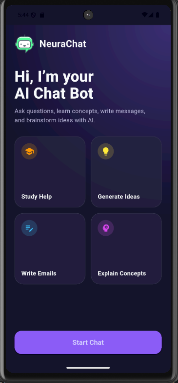
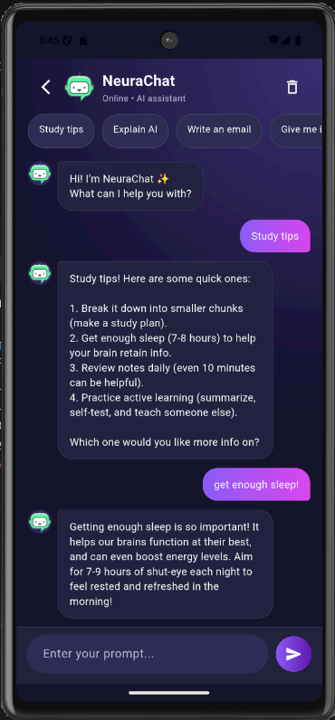

# 🤖 NeuraChat – AI Mobile Chat Application

NeuraChat is a modern AI-powered mobile chat application built using Flutter, with a Node.js backend and local LLM integration (Ollama).  
The app provides an interactive and visually engaging chat experience with a custom-designed UI and real-time AI responses.

---

## ✨ Features

- 💬 AI-powered chat assistant  
- 🎨 Modern UI with dark gradient theme  
- ⚡ Quick prompt suggestions  
- ⏳ Typing animation for realistic interaction  
- 🧼 Clear chat functionality  
- 🤖 Custom bot avatar & branding  
- 📱 Mobile-first design (Flutter)  
- 💰 Runs with local AI (no API cost)

---

## 🛠️ Tech Stack

- **Frontend:** Flutter  
- **Backend:** Node.js (Express)  
- **AI Model:** Ollama (Local LLM – LLaMA)  
- **Communication:** REST API (HTTP)

---

## 📸 Screenshots




---

## 🚀 How to Run the Project

### 1️⃣ Backend

```bash
cd backend
npm install
node server.js
```
### 2️⃣ Flutter App

```bash
cd flutter_app
flutter pub get
flutter run
```
